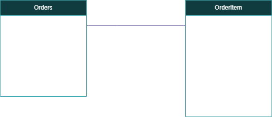

# Order Service – Webshop Backend

[](https://www.oracle.com/java/)
[](https://maven.apache.org/)
[](https://spring.io/projects/spring-boot)

[](https://github.com/fhburgenland-bswe/swm2-ws2025-group-a-order/actions/workflows/verify.yml)

## Project Overview

The **Order Service** is a core backend component of a webshop system.  
It manages and provides details for all orders made, including:

### Architecture

The project follows a clean-layered architecture:

```
├── Controller Layer    - REST API endpoints
├── Service Layer       - Business logic
├── Repository Layer    - Data access
└── Domain Layer        - Entities and DTOs
```

### Order Details

- **OrderId** - Unique identifier for each order
- **TotalPrice** - Total price of the order
- **Status** - Current order status
- **CreationDate** - Date and time when the order was created
- **OrderItems** - List of products ordered with their respective quantities

### OrderItem Details

- **ID** – Unique identifier for each product
- **ItemId** – Unique identifier for each product in the order
- **ItemName** - Name of the product ordered
- **Quantity** – Quantity of the product ordered
- **Price** – Unit price of the product

### Order ER Diagram



The service is built with **Java 24** and **Maven**, following a modular, RESTful design.  
It can be integrated into a larger microservice-based webshop architecture or used as a standalone component.

---

## Usage

### Prerequisites

- Java 24 or later
- Maven 3.9+

### Running the Application

1. Clone the repository:
    ```bash
    git clone https://github.com/fhburgenland-bswe/swm2-ws2025-group-a-order.git

2. Build the Project:
    ```bash
    mvn clean package
3. Run generated JAR file:
    ```bash
   java -jar target/order-service-0.0.1-SNAPSHOT.jar

4. Access the API:
   http://localhost:8081/api/order

5. Endpoint:

| Method | Endpoint          | Description        |
|--------|-------------------|--------------------|
| `POST` | `/api/order`      | Create new order   |
| `GET`  | `/api/order`      | Get all orders     |
| `GET`  | `/api/order/{id}` | Get order by ID    |
| `PUT`  | `/api/order/{id}` | Update order by ID |

---

## CI/CD Status and Workflow (GitHub Actions)

- Status: see the badge at the top of this README. Clicking it opens the workflow run history.
- Workflow file: `.github/workflows/verify.yml` (name: "Verify").
- Triggers: on pull requests to `main`.
- Jobs overview:
    - Conform: validates commit messages and PR metadata.
    - Checkstyle: runs `mvn clean verify checkstyle:check` on Java 24 (Corretto) and fails on violations.
    - PMD: runs `mvn pmd:check pmd:pmd` and uploads `target/pmd.xml` artifacts.
    - SpotBugs: runs `mvn spotbugs:check` and generates SpotBugs reports.
    - Hadolint: lints `Dockerfile` (skipped if no Dockerfile).

To run a similar verification locally:

```bash
mvn -B clean verify
```

## Code Style: Checkstyle

This project uses Checkstyle to enforce a consistent Java coding style.

- Configuration: config/checkstyle/checkstyle.xml (with suppressions in config/checkstyle/checkstyle-suppressions.xml)
- Maven plugin: org.apache.maven.plugins:maven-checkstyle-plugin (configured in pom.xml)
- Fails the build on violations (default behavior in this repo)

How to run locally:

- Quick check: mvn -B checkstyle:check
- Full validation: mvn -B clean verify

``` bash
mvn checkstyle:check
```

Reports:

- HTML report: target/reports/checkstyle.html
- XML report: target/checkstyle-result.xml

Continuous Integration:

- Checkstyle runs in CI for every pull request. See .github/workflows/verify.yml
- Checkstyle violations fail the pipeline.

## Code Style: PMD

This project integrates PMD (Programming Mistake Detector)
to identify common programming issues and enforce best practices automatically during continuous integration.

- Configuration: config/pmd/ruleset.xml (customized ruleset for this project)
- Maven plugin: org.apache.maven.plugins:maven-pmd-plugin (configured in pom.xml)
- Fails the build on rule violations — no code with PMD errors can be merged.

How to run locally:

- Quick check: mvn -B pmd:check
- Full validation: mvn -B clean verify

``` bash
mvn pmd:check
```

Reports:

- XML report: target/pmd.xml

Continuous Integration:

- PMD runs automatically in GitHub Actions as part of the verify.yml workflow.
- Uses Java 24 (Amazon Corretto) runtime.
- Runs before the build job — if PMD fails, the build is skipped.
- Ensures consistent code quality and prevents merging of code with PMD violations.

## SpotBugs Integration in CI/CD

SpotBugs is integrated into the GitHub Actions CI/CD workflow to ensure all code meets quality and reliability standards
before being merged into main.

Workflow Details

The SpotBugs job runs automatically as part of the pipeline defined in .github/workflows/verify.yml.

It uses Amazon Corretto 24 to analyze the Java source code for potential bugs and bad practices.

The build job depends on the successful completion of the SpotBugs analysis — if SpotBugs fails, the pipeline will not
continue.

Running SpotBugs Locally

You can also run SpotBugs manually to analyze your code before committing changes:

```bash
mvn spotbugs:check
```

### Clean and compile the project

```bash
mvn clean compile
```

### Run SpotBugs analysis

mvn spotbugs:spotbugs

Reports are generated in:

target/spotbugsXml.xml — XML report format

## Dockerfile Linting with Hadolint

This project includes a Hadolint job in the CI/CD pipeline to ensure that the Dockerfile follows best practices and
coding standards.

### Workflow Details:

1. **Checks if a `Dockerfile` exists**:
    - Skips Hadolint if absent.

2. **Hadolint Execution**:
    - Uses the `hadolint/hadolint-action@v3.1.0` and scans the `Dockerfile`.
    - Ignores certain linting rules (e.g., `DL3008`, `DL3013`).

3. **Manual Installation**:
    - Hadolint is installed directly on the runner for additional checks:
      ```bash
      wget -O /usr/local/bin/hadolint https://github.com/hadolint/hadolint/releases/latest/download/hadolint-Linux-x86_64
      chmod +x /usr/local/bin/hadolint
      ```

4. **Failure Handling**:
   Warnings are ignored, but errors cause the pipeline to fail:
    ```bash
    hadolint Dockerfile --failure-threshold error
    ```

### Run Locally:

If you want to verify your `Dockerfile` locally with Hadolint:

1. Install Hadolint:
    ```bash
    wget -O /usr/local/bin/hadolint https://github.com/hadolint/hadolint/releases/latest/download/hadolint-Linux-x86_64
    chmod +x /usr/local/bin/hadolint
    ```
2. Run linting:
    ```bash
    hadolint Dockerfile
    ```

Hadolint ensures that Docker images are built following best practices to optimize size, security, and build speed.

## Container Build \& Push (CI)

This project builds and pushes Docker images in CI only if the Dockerfile linting check (`Run Hadolint`) completed
successfully.
The related job in `verify.yml` is named `Containerization and Push to Harbor` and has `needs: build & hadolint`, so
only lint-checked Dockerfiles are used for image builds.

### Purpose

- Ensure only lint-verified Dockerfiles are used for images (security \& quality).
- Automatically build the JAR, build the image, tag it, and push it to the registry.

### CI Flow

1. Build the JAR with Maven: `mvn clean package -DskipTests`
2. CI logs into the container registry (authentication via Secrets).
3. The Docker image is built and tagged with two tags:
    - Commit SHA: `${{ github.sha }}`
4. Both tags are pushed to the registry.
5. The pipeline outputs the registry URL with the Commit SHA to confirm availability.

### Required GitHub Secrets

- `HARBOR_REGISTRY_URL` — target registry URL (e.g. `registry.example.com/project/name`)
- `HARBOR_ROBOT_NAME` — username / robot for login
- `HARBOR_ROBOT_SECRET` — password / secret for login

### Local testing

   ```bash
   mvn clean package -DskipTests

   docker login <registry> -u <user> -p <password>
   docker build -t <registry>:latest -t <registry>:<commit-sha> .
   docker push <registry>:<commit-sha>
   ```

## Production Configuration

Configure PostgreSQL for production:

```properties
spring.datasource.url=${DB_URL}
spring.datasource.username=${DB_USERNAME}
spring.datasource.password=${DB_PASSWORD}
spring.jpa.database-platform=org.hibernate.dialect.PostgreSQLDialect
```

### Security Configuration

This project uses Spring Security to configure the application's HTTP security and CORS policies.
The `SecurityConfig` class is responsible for defining these configurations.

#### Key Features:

1. **HTTP Security**:
    - CSRF protection is disabled to simplify API interactions.
    - CORS (Cross-Origin Resource Sharing) is enabled to allow communication from multiple origins.
    - Specific requests are explicitly permitted:
        - /api/order/** (API endpoints for order services)
        - /h2-console/** (for development environments using the H2 database console—enabled with same-origin frame
          settings).
2. **Custom CORS Configurations**:
    - All origins (`*`) are allowed.
    - Allowed `HTTP` methods: `GET`, `POST`, `PUT`.
    - All headers are allowed, and certain headers are exposed (`Authorization`, `Link`).
    - Credentials are supported for cross-origin requests.
    - Preflight request max age set to 3600 seconds.

#### Configuration Beans:

- `SecurityFilterChain`: Defines the security filter chain for handling HTTP requests.
- `CorsConfigurationSource`: Provides the CORS configuration for the application.

This configuration ensures that the application is secure while allowing flexibility for frontend clients and external
systems to interact with the API seamlessly.

#### Development Notes:

- The `SecurityConfig` class includes settings for enabling the H2 console UI by allowing its frames (`same-origin`
  policy).
- You can modify or extend the security rules as needed by changing the `authorizeHttpRequests` section.

### Configuration

#### External Inventory Integration

The Order Service can call multiple external inventory providers.
Providers are configured via Spring Boot properties under the prefix `external.inventory` and bound to
`test.serviceb.service.converter.ConversionProperties`.

- Prefix: `external.inventory`.
- Key: `external-inventory-<name>`.
- Value: `<name>,<url>`
  Example:
- Application Properties:
    - `external.inventory.external-inventory-a=inventory-a,https://alpha.example.com/api/inventory`
- When Running the service Image:
- ```bash 
  docker run -e external.inventory.external-inventory-a=inventory-a,https://alpha.example.com/api/inventory
  ```

**⚠️ IMPORTANT NOTE ⚠️**

The Items in the External Inventory Service must have a unique ID, and the name of the Item must start or at least have
the service name in it, to avoid conflicts with other services.
This way it is assured that the order service is able to handle items from different services that share the same id,
as long as the service names differ.

##### Example:

For the External Inventory Service `inventory-a` the name of an Item should look like this:

``` json
{
    "name": "inventory-a: Sunset over the mountains",
    "stock": 15,
    "price": 49.99,
    "description": "A beautiful high-resolution photograph."
}
```

#### Environment Variables

- `DB_USERNAME` - Database username
- `DB_PASSWORD` - Database password
- `DB_URL` - Database URL

## Local & testing Configuration

Configure H2 for local & testing:

Local run (Windows — PowerShell)

```bash
export DB_URL='jdbc:postgresql://<host>:<port>/<dbname>?sslmode=require'
export DB_USERNAME='<user>'
export DB_PASSWORD='<pass>'
mvn spring-boot:run -Dspring-boot.run.profiles=prod
```

Run tests (H2)

```bash
mvn -Dspring.profiles.active=test test
```

## Automated Release Management (Release Please)

This project uses Release Please, a Google-maintained automation tool, to manage versioning, changelog generation,
GitHub Releases, and automated container publishing.

The release workflow is fully automated and triggers whenever a pull request is merged into the `main` branch.

### Automated Versioning & Tag Creation

The release workflow determines the next version based on Conventional Commit prefixes found in merged pull requests.

Release Please creates a Git tag in the format: `v1.0.0`

### GitHub Release Creation

- Once the release PR is merged:
- A GitHub Release is created automatically.
- The release notes include the generated changelog sections.
- The version tag (e.g., `v1.0.0`) is attached.

### Automated Container Build & Publish

#### After tagging:

- The Maven project is built from the release commit.
- A Container image is generated.
- The image is pushed to your Harbor registry using the version tag.

This guarantees each release is paired with a reproducible, versioned container image.

### Automatic CHANGELOG.md Generation

Release Please updates CHANGELOG.md using our custom configuration:

| Commit Prefix | Changelog Section      | Visible    |
|---------------|------------------------|------------|
| `feat:`       | Feature                | ✔️         |
| `fix:`        | Bug Fixes              | ✔️         |
| `chore:`      | Miscellaneous Chores   | ✔️         |
| `docs:`       | Documentation          | ❌ (hidden) |
| `ci:`         | Continuous Integration | ❌ (hidden) |

Only visible sections appear in the published changelog.

## LICENSE

This repository is licensed under the MIT License. See the [LICENSE](LICENSE) file for more information.
Only the specification files are licensed under the MIT License and not the services or their code!